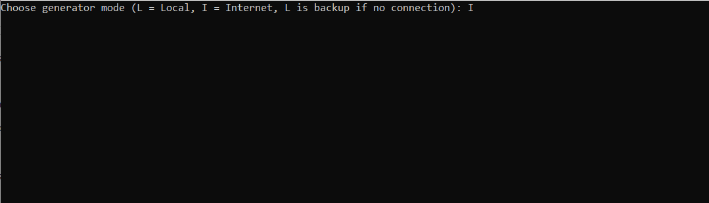
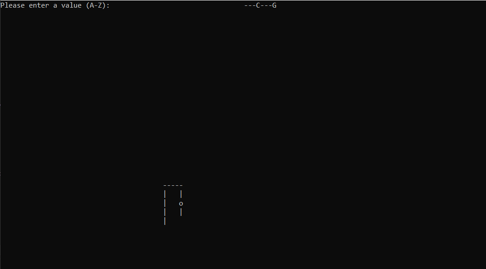
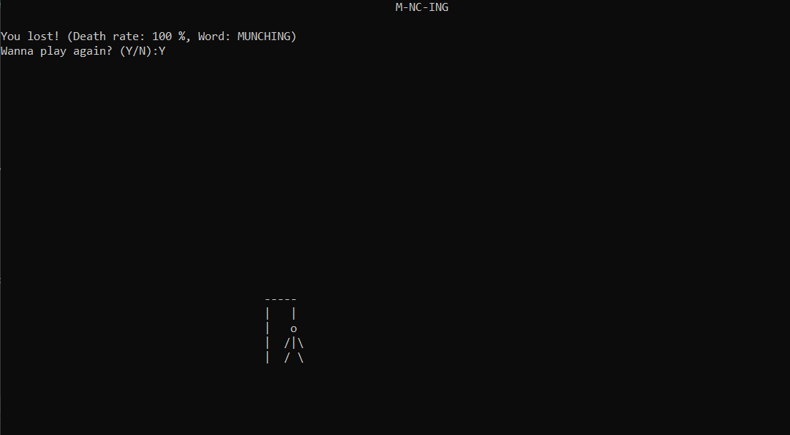

# Hangman
Represents a clean implementation of the game Hangman in C#.
It is a console application where the user is prompted to choose a word library from Internet or local network.
Afterwards, the user has to guess the word.
Enjoy!

## Used technologies
 

## Screenshots

